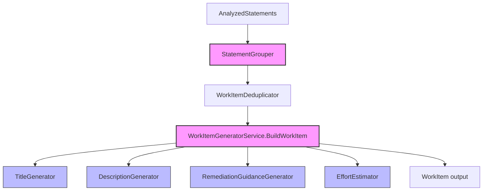
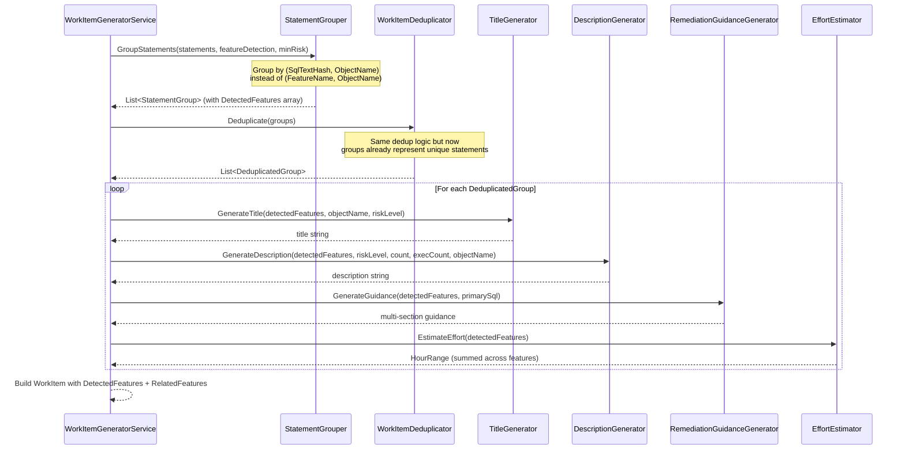

# Design Document: Group Work Items by Statement

## Overview

This feature changes the work item grouping strategy from grouping by *(FeatureName, DatabaseObjectName)* to grouping by *(SqlText hash, DatabaseObjectName)*. Currently, a single `SELECT` statement using `ISNULL`, `DATEDIFF`, and `GETDATE` produces three separate work items — one per detected feature. The new behavior produces one work item per unique statement, listing all detected features together. This reduces noise, provides holistic remediation guidance, and gives developers a single ticket per SQL statement they need to fix.

The change is scoped to the `MigrationAssessment.WorkItems` project and affects the grouper, deduplicator, effort estimator, title generator, description generator, remediation guidance generator, and the `WorkItem` model. The `IStatementGrouper` interface remains backward-compatible (same method signatures), and server-level features (from `FeatureDetectionResult`) continue to get their own work items unchanged.

## Architecture

The overall pipeline flow remains the same — only the internal grouping key and downstream consumers of `StatementGroup` change:



**Pink nodes** = components with significant logic changes.  
**Blue nodes** = components with interface/signature changes.

## Sequence Diagrams

### Main Flow: Statement-Based Grouping



## Components and Interfaces

### Component 1: StatementGrouper (Modified)

**Purpose**: Groups analyzed statements by unique SQL text + database object instead of feature + database object.

**Interface** (unchanged signatures, new internal behavior):
```csharp
public interface IStatementGrouper
{
    IReadOnlyList<StatementGroup> GroupStatements(
        IReadOnlyList<AnalyzedStatement> statements,
        FeatureDetectionResult featureDetection,
        int minimumRiskLevel);

    IReadOnlyList<StatementGroup> GroupStatements(
        IReadOnlyList<AnalyzedStatement> statements,
        FeatureDetectionResult featureDetection,
        int minimumRiskLevel,
        IReadOnlyList<ObjectInventoryEntry> objectInventory);
}
```

**Key Change**: The grouping key changes from `(FeatureName, DatabaseObjectName)` to `(SqlTextHash, DatabaseObjectName)`. Each `StatementGroup` now carries ALL detected features for that statement.

### Component 2: StatementGroup Model (Modified)

**Purpose**: Represents a group of statements that share the same SQL text hash and database object.

```csharp
public sealed record StatementGroup
{
    /// <summary>Primary feature name (highest risk) — retained for backward compat.</summary>
    public required string FeatureName { get; init; }

    /// <summary>ALL features detected in statements in this group.</summary>
    public required IReadOnlyList<string> DetectedFeatures { get; init; }

    public string? DatabaseObjectName { get; init; }
    public string DatabaseObjectType { get; init; } = "AdHoc";
    public required IReadOnlyList<AnalyzedStatement> Statements { get; init; }
    public bool IsServerLevelFeature { get; init; }
    public required int MaxRiskLevel { get; init; }
}
```

### Component 3: WorkItem Model (Extended)

**Purpose**: Adds `DetectedFeatures` and `RelatedFeatures` arrays.

```csharp
public sealed record WorkItem
{
    // ... existing properties unchanged ...

    /// <summary>All feature names detected in this work item's statement(s).</summary>
    public IReadOnlyList<string> DetectedFeatures { get; init; } = [];

    /// <summary>Distinct feature names for filtering (same as DetectedFeatures distinct).</summary>
    public IReadOnlyList<string> RelatedFeatures { get; init; } = [];
}
```

### Component 4: TitleGenerator (Modified)

**Purpose**: Generates title based on feature count.

```csharp
public sealed class TitleGenerator
{
    /// <summary>
    /// Single-feature: "[Risk N] Convert feature_name in object_name"
    /// Multi-feature:  "[Risk N] Convert N features in object_name"
    /// </summary>
    public string GenerateTitle(IReadOnlyList<string> detectedFeatures, string? objectName, int riskLevel);

    // Keep old overload for backward compat (delegates to new one)
    public string GenerateTitle(string featureName, string? objectName, int riskLevel);
}
```

### Component 5: DescriptionGenerator (Modified)

**Purpose**: Generates description listing all detected features.

```csharp
public sealed class DescriptionGenerator
{
    public string GenerateDescription(
        IReadOnlyList<string> detectedFeatures,
        int riskLevel,
        int occurrenceCount,
        long totalExecutionCount,
        string? objectName);

    // Keep old overload for backward compat
    public string GenerateDescription(
        string featureName, int riskLevel, int occurrenceCount,
        long totalExecutionCount, string? objectName);
}
```

### Component 6: RemediationGuidanceGenerator (Modified)

**Purpose**: Generates multi-section guidance with one section per feature.

```csharp
public sealed class RemediationGuidanceGenerator
{
    /// <summary>
    /// Generates guidance with one "### FeatureName" section per detected feature.
    /// </summary>
    public (string Guidance, bool RequiresResearch) GenerateGuidance(
        IReadOnlyList<string> detectedFeatures, string primarySqlText);

    // Keep old overload for backward compat
    public (string Guidance, bool RequiresResearch) GenerateGuidance(
        string featureName, string primarySqlText);
}
```

### Component 7: EffortEstimator (Modified)

**Purpose**: Sums effort ranges across distinct features' risk levels.

```csharp
public interface IEffortEstimator
{
    /// <summary>
    /// Estimates effort for a multi-feature work item.
    /// Sums per-feature effort ranges for each distinct feature's risk level.
    /// </summary>
    HourRange EstimateEffort(IReadOnlyList<string> detectedFeatures, int statementCount);

    // Keep old overload for backward compat
    HourRange EstimateEffort(int riskLevel, int statementCount);

    HourRange CalculateTotalEffort(IReadOnlyList<WorkItem> workItems);
}
```

## Data Models

### StatementGroup (updated)

```csharp
public sealed record StatementGroup
{
    public required string FeatureName { get; init; }              // Primary (highest-risk) feature
    public required IReadOnlyList<string> DetectedFeatures { get; init; } // NEW: all features
    public string? DatabaseObjectName { get; init; }
    public string DatabaseObjectType { get; init; } = "AdHoc";
    public required IReadOnlyList<AnalyzedStatement> Statements { get; init; }
    public bool IsServerLevelFeature { get; init; }
    public required int MaxRiskLevel { get; init; }
}
```

**Validation Rules**:
- `DetectedFeatures` must contain at least one entry
- `FeatureName` must be equal to the highest-risk feature in `DetectedFeatures`
- `MaxRiskLevel` must equal `max(risk(f) for f in DetectedFeatures)`

### WorkItem (extended)

```csharp
public sealed record WorkItem
{
    public required string Id { get; init; }
    public required string Title { get; init; }
    public required string Description { get; init; }
    public required string SqlServerPattern { get; init; }
    public required string PostgresEquivalent { get; init; }
    public required IReadOnlyList<AffectedObject> AffectedObjects { get; init; }
    public required int RiskLevel { get; init; }
    public required string Priority { get; init; }
    public required double PriorityScore { get; init; }
    public required HourRange EstimatedEffort { get; init; }
    public required IReadOnlyList<string> AcceptanceCriteria { get; init; }
    public required string RemediationGuidance { get; init; }
    public required IReadOnlyList<string> Tags { get; init; }
    public IReadOnlyList<string> RelatedWorkItemIds { get; init; } = [];
    public IReadOnlyList<string> DetectedFeatures { get; init; } = [];   // NEW
    public IReadOnlyList<string> RelatedFeatures { get; init; } = [];    // NEW
}
```

## Key Functions with Formal Specifications

### Function 1: StatementGrouper.GroupStatementsInternal()

```csharp
private IReadOnlyList<StatementGroup> GroupStatementsInternal(
    IReadOnlyList<AnalyzedStatement> statements,
    FeatureDetectionResult featureDetection,
    int minimumRiskLevel,
    IReadOnlyList<ObjectInventoryEntry>? objectInventory)
```

**Preconditions:**
- `statements` is non-null
- `featureDetection` is non-null
- `minimumRiskLevel` is in range [1, 5]

**Postconditions:**
- Each returned `StatementGroup` has a unique `(SqlTextHash, DatabaseObjectName)` key
- `DetectedFeatures` contains all distinct feature names from all statements sharing that hash + object
- `FeatureName` equals the feature with the highest risk level from `DetectedFeatures`
- `MaxRiskLevel` equals the maximum risk among all `DetectedFeatures`
- No statement with `RiskScore < minimumRiskLevel` appears in any group
- Server-level groups from `featureDetection` are appended unchanged

### Function 2: TitleGenerator.GenerateTitle() (new overload)

```csharp
public string GenerateTitle(IReadOnlyList<string> detectedFeatures, string? objectName, int riskLevel)
```

**Preconditions:**
- `detectedFeatures` is non-null and contains at least one entry
- `riskLevel` is in range [1, 5]

**Postconditions:**
- If `detectedFeatures.Count == 1`: returns `"[Risk N] Convert {feature} in {object}"`
- If `detectedFeatures.Count > 1`: returns `"[Risk N] Convert {count} features in {object}"`
- Result length ≤ 120 characters
- If object name would cause overflow, it is truncated with "..."

### Function 3: RemediationGuidanceGenerator.GenerateGuidance() (new overload)

```csharp
public (string Guidance, bool RequiresResearch) GenerateGuidance(
    IReadOnlyList<string> detectedFeatures, string primarySqlText)
```

**Preconditions:**
- `detectedFeatures` is non-null and contains at least one entry
- `primarySqlText` may be null/empty

**Postconditions:**
- Guidance contains one `### {FeatureName}` section per feature in `detectedFeatures`
- Each section contains the knowledge-base guidance for that feature (or manual analysis note)
- `RequiresResearch` is true if ANY feature lacks a known mapping
- SQL example appears once at the top, not duplicated per feature

### Function 4: EffortEstimator.EstimateEffort() (new overload)

```csharp
public HourRange EstimateEffort(IReadOnlyList<string> detectedFeatures, int statementCount)
```

**Preconditions:**
- `detectedFeatures` is non-null and contains at least one entry
- `statementCount` ≥ 1

**Postconditions:**
- Returns `sum(EstimateEffort(risk(feature), statementCount) for each distinct feature)`
- Each feature's contribution uses its own risk level from the feature-risk map
- The geometric reduction factor (0.7) is applied per-feature independently

## Algorithmic Pseudocode

### Statement-Based Grouping Algorithm

```csharp
// NEW grouping key: hash of SqlText + DatabaseObjectName
// Instead of: (FeatureName, DatabaseObjectName)

private IReadOnlyList<StatementGroup> GroupStatementsInternal(...)
{
    var statementToObject = BuildStatementToObjectMap(statements, objectInventory);

    // Filter by minimum risk level
    var filtered = statements.Where(s => s.RiskScore >= minimumRiskLevel).ToList();

    // Group by (SqlText hash, DatabaseObjectName)
    var groups = new Dictionary<(string SqlHash, string? ObjectName), List<AnalyzedStatement>>();

    foreach (var statement in filtered)
    {
        var sqlHash = ComputeHash(statement.Source.SqlText);
        string? objectName = ResolveObjectName(statement, statementToObject);

        var key = (sqlHash, objectName);
        if (!groups.TryGetValue(key, out var list))
        {
            list = new List<AnalyzedStatement>();
            groups[key] = list;
        }
        list.Add(statement);
    }

    // Build StatementGroup for each hash-group
    var result = new List<StatementGroup>();
    foreach (var (key, statementsInGroup) in groups)
    {
        // Collect ALL distinct features across all statements in this group
        var allFeatures = statementsInGroup
            .SelectMany(s => s.Features)
            .Select(f => f.FeatureName)
            .Distinct(StringComparer.OrdinalIgnoreCase)
            .ToList();

        var maxRisk = allFeatures.Max(f => GetFeatureRiskLevel(f));
        var primaryFeature = allFeatures
            .OrderByDescending(f => GetFeatureRiskLevel(f))
            .First();

        result.Add(new StatementGroup
        {
            FeatureName = primaryFeature,
            DetectedFeatures = allFeatures,
            DatabaseObjectName = key.ObjectName,
            Statements = statementsInGroup,
            MaxRiskLevel = maxRisk,
            IsServerLevelFeature = false
        });
    }

    // Append server-level groups unchanged
    result.AddRange(CreateServerLevelGroups(featureDetection));
    return result;
}
```

### Multi-Feature Effort Estimation Algorithm

```csharp
public HourRange EstimateEffort(IReadOnlyList<string> detectedFeatures, int statementCount)
{
    if (statementCount <= 0 || detectedFeatures.Count == 0)
        return new HourRange { MinHours = 0, MaxHours = 0 };

    double totalMin = 0, totalMax = 0;

    foreach (var feature in detectedFeatures.Distinct(StringComparer.OrdinalIgnoreCase))
    {
        var riskLevel = GetFeatureRiskLevel(feature);
        var featureEffort = EstimateEffort(riskLevel, statementCount);
        totalMin += featureEffort.MinHours;
        totalMax += featureEffort.MaxHours;
    }

    return new HourRange { MinHours = totalMin, MaxHours = totalMax };
}
```

### Multi-Feature Title Generation Algorithm

```csharp
public string GenerateTitle(IReadOnlyList<string> detectedFeatures, string? objectName, int riskLevel)
{
    var resolvedObject = objectName ?? "Ad Hoc Queries";

    string featurePart;
    if (detectedFeatures.Count == 1)
        featurePart = detectedFeatures[0];
    else
        featurePart = $"{detectedFeatures.Count} features";

    var prefix = $"[Risk {riskLevel}] Convert {featurePart} in ";
    var fullTitle = prefix + resolvedObject;

    if (fullTitle.Length <= MaxTitleLength)
        return fullTitle;

    var available = MaxTitleLength - prefix.Length - TruncationSuffix.Length;
    if (available <= 0)
        return fullTitle[..MaxTitleLength];

    return prefix + resolvedObject[..available] + TruncationSuffix;
}
```

### Multi-Feature Remediation Guidance Algorithm

```csharp
public (string Guidance, bool RequiresResearch) GenerateGuidance(
    IReadOnlyList<string> detectedFeatures, string primarySqlText)
{
    var truncatedSql = TruncateSql(primarySqlText);
    var sb = new StringBuilder();
    var anyRequiresResearch = false;

    // Shared "Before" section at top
    sb.AppendLine("## Before (SQL Server)");
    sb.AppendLine();
    sb.AppendLine("```sql");
    sb.AppendLine(truncatedSql);
    sb.AppendLine("```");
    sb.AppendLine();

    // One section per feature
    foreach (var feature in detectedFeatures)
    {
        sb.AppendLine($"### {feature}");
        sb.AppendLine();

        var entry = _knowledgeBase.GetGuidance(feature);
        if (entry is null)
        {
            sb.AppendLine($"No known PostgreSQL equivalent for '{feature}'. Manual analysis required.");
            anyRequiresResearch = true;
        }
        else
        {
            sb.AppendLine(entry.IncompatibilityExplanation);
            sb.AppendLine();
            sb.AppendLine("**PostgreSQL equivalent:**");
            sb.AppendLine("```sql");
            sb.AppendLine(entry.PostgresEquivalent);
            sb.AppendLine("```");
            sb.AppendLine();
            sb.AppendLine(entry.RemediationSteps);
        }
        sb.AppendLine();
    }

    return (sb.ToString(), anyRequiresResearch);
}
```

## Example Usage

```csharp
// Given a SELECT that uses ISNULL, DATEDIFF, and GETDATE:
var statement = new AnalyzedStatement
{
    Source = new CollectedStatement
    {
        SqlText = "SELECT ISNULL(col, 0), DATEDIFF(day, start, GETDATE()) FROM dbo.Orders",
        QueryHash = "ABC123",
        Source = StatementSource.QueryStore,
        ExecutionCount = 500
    },
    Features = new[]
    {
        new DetectedFeature { FeatureName = "ISNULL", Category = FeatureCategory.FunctionUsage, ... },
        new DetectedFeature { FeatureName = "DATEDIFF", Category = FeatureCategory.FunctionUsage, ... },
        new DetectedFeature { FeatureName = "GETDATE", Category = FeatureCategory.FunctionUsage, ... }
    },
    RiskScore = 2,
    WeightedRisk = 1000.0
};

// OLD behavior: produces 3 work items (one per feature)
// NEW behavior: produces 1 work item with:
//   DetectedFeatures = ["ISNULL", "DATEDIFF", "GETDATE"]
//   Title = "[Risk 2] Convert 3 features in dbo.Orders"
//   RemediationGuidance = "### ISNULL\n...\n### DATEDIFF\n...\n### GETDATE\n..."
//   Effort = sum of effort(risk=2, count=1) for each feature
```

## Error Handling

### Scenario 1: Empty DetectedFeatures after grouping

**Condition**: A statement group ends up with no detected features (e.g., all features filtered out)
**Response**: Skip the group — do not produce a work item
**Recovery**: Log a debug warning

### Scenario 2: Unknown feature in DetectedFeatures for effort estimation

**Condition**: A feature name is not in the `FeatureRiskMap`
**Response**: Default to risk level 1 (same as current behavior in `GetFeatureRiskLevel`)
**Recovery**: No special recovery needed — produces minimal effort

### Scenario 3: Hash collision (two different SQL texts produce same hash)

**Condition**: SHA-256 hash collision (astronomically unlikely)
**Response**: Statements are grouped together — functionally equivalent to deduplication
**Recovery**: No action needed; SHA-256 collision probability is negligible

## Testing Strategy

### Unit Testing Approach

- Test `StatementGrouper` with inputs that have co-located features → verify single group produced
- Test `TitleGenerator` with 1 vs. multiple features → verify correct format
- Test `EffortEstimator` with multiple features → verify sum matches individual efforts
- Test `RemediationGuidanceGenerator` with multiple features → verify all sections present
- Backward compatibility: ensure old single-feature overloads still work correctly

### Property-Based Testing Approach

**Property Test Library**: FsCheck (already used via xUnit integration in the project)

Key properties:
1. **Grouping reduces count**: For any input with co-located features, statement-based grouping produces ≤ feature-based grouping count
2. **No duplicate SqlServerPattern**: No two work items share the same `SqlServerPattern` string
3. **Guidance completeness**: Every feature in `DetectedFeatures` has a corresponding section in guidance
4. **Effort is additive**: Multi-feature effort = sum of individual per-feature efforts
5. **Title format correctness**: Single feature → feature name in title; multiple → count in title

### Integration Testing Approach

- End-to-end test with a realistic assessment containing co-located features
- Verify JSON output schema still validates
- Verify total work item count is reduced vs. old behavior

## Performance Considerations

- SHA-256 hashing of SQL text is O(n) where n = text length. Since statements are already loaded in memory and max 500 chars are used in patterns, this is negligible.
- The grouping pass is now a single pass over statements (previously it iterated per-feature). This is actually a performance improvement for statements with many features.
- No additional database calls or I/O introduced.

## Security Considerations

- No new external inputs or attack surfaces introduced.
- SQL text hashing uses `System.Security.Cryptography.SHA256` — not for security purposes, just for grouping key stability. Could also use `string.GetHashCode()` but SHA-256 avoids process-lifetime instability.

## Dependencies

- `System.Security.Cryptography` (for SHA-256 hash of SQL text) — already available in .NET 8
- No new NuGet packages required
- All changes are internal to `MigrationAssessment.WorkItems` project

## Correctness Properties

*A property is a characteristic or behavior that should hold true across all valid executions of a system — essentially, a formal statement about what the system should do. Properties serve as the bridge between human-readable specifications and machine-verifiable correctness guarantees.*

### Property 1: Statement-based grouping reduces work item count

*For any* set of analyzed statements where at least one statement contains multiple detected features in the same database object, the number of `StatementGroup` records produced by statement-based grouping SHALL be less than or equal to the number produced by the old feature-based grouping.

**Validates: Requirements 1**

### Property 2: No duplicate SqlServerPattern across work items

*For any* valid set of analyzed statements and feature detection results, no two work items in the output SHALL have the same `SqlServerPattern` string value.

**Validates: Requirements 9.4**

### Property 3: Remediation guidance covers all detected features

*For any* work item with `DetectedFeatures` containing N features, the `RemediationGuidance` string SHALL contain exactly N `###`-headed sections, one for each feature name in `DetectedFeatures`.

**Validates: Requirements 6.1**

### Property 4: Effort is sum of per-feature efforts

*For any* work item with `DetectedFeatures = [f1, f2, ..., fn]` and statement count S, the estimated effort SHALL equal `sum(EstimateEffort(risk(fi), S) for i in 1..n)`.

**Validates: Requirements 7.1**

### Property 5: Title format reflects feature count

*For any* work item, if `DetectedFeatures.Count == 1` then the title SHALL contain the feature name; if `DetectedFeatures.Count > 1` then the title SHALL contain `"{count} features"`.

**Validates: Requirements 4.1, 4.2**

### Property 6: MaxRiskLevel equals highest feature risk

*For any* `StatementGroup` with `DetectedFeatures`, the `MaxRiskLevel` SHALL equal the maximum of `GetFeatureRiskLevel(f)` for all `f` in `DetectedFeatures`.

**Validates: Requirements 1.5**

### Property 7: Server-level features remain isolated

*For any* input containing server-level features in `FeatureDetectionResult`, each server-level feature SHALL produce its own separate `StatementGroup` with `IsServerLevelFeature = true`, unaffected by statement-based grouping.

**Validates: Requirements 2**
