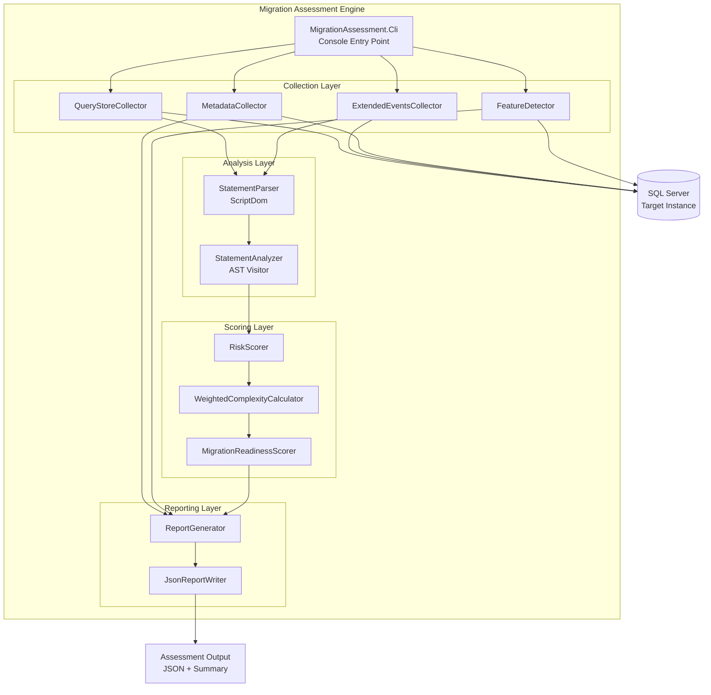
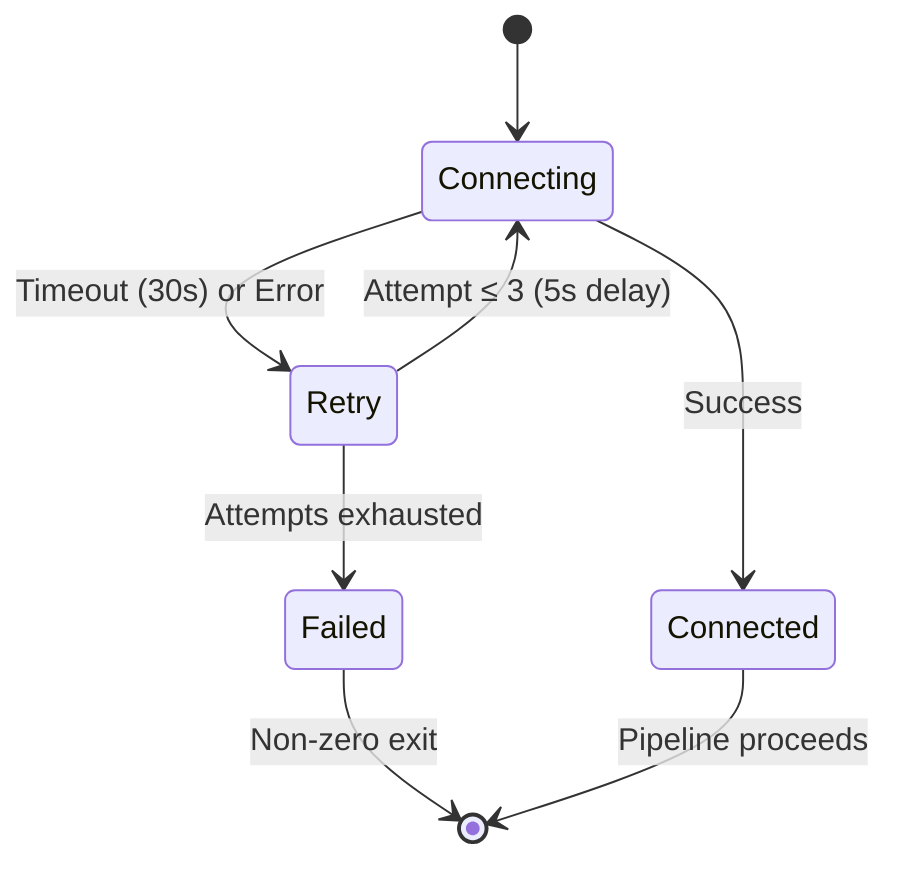

# Design Document: Migration Assessment Engine

## Overview

The Migration Assessment Engine is a standalone component within the ODBC_TSQL_To_SQL solution that connects to a live SQL Server instance, collects workload and metadata information, parses captured T-SQL using Microsoft.SqlServer.TransactSql.ScriptDom, scores each statement's migration risk to PostgreSQL, and produces a comprehensive assessment report in both human-readable and machine-readable (JSON) formats.

The engine is designed as a command-line tool (console application) that runs independently from the PgPassthrough runtime proxy. It shares the solution structure and follows the same architectural patterns (interface-based abstractions, visitor pattern for AST traversal, xUnit testing) but operates in an offline, batch-analysis mode rather than real-time query interception.

### Key Design Decisions

1. **ScriptDom over custom parser**: The existing `PgPassthrough.SqlParser` is a lightweight recursive-descent parser built for real-time translation. The assessment engine requires full T-SQL grammar coverage (procedures, triggers, DDL, system functions) that ScriptDom provides out-of-the-box. The two parsers serve different use cases and coexist without conflict.

2. **Separate project hierarchy**: The assessment engine lives under `MigrationAssessment/` at the solution root rather than under `PgPassthrough/src/`. This keeps the runtime proxy lean and avoids pulling ScriptDom (a large dependency) into the proxy's deployment.

3. **Pipeline architecture**: Data flows through discrete, composable stages — Collection → Parsing → Analysis → Scoring → Reporting — each with a clear interface boundary. Stages can be tested independently.

4. **Graceful degradation**: Every data source (Query Store, Extended Events, Metadata, Feature Detection) operates independently. Failure in one source logs a warning and the pipeline continues with remaining data.

## Architecture



### Layer Responsibilities

| Layer | Responsibility |
|-------|---------------|
| **CLI** | Argument parsing, DI composition, orchestration of the assessment pipeline |
| **Collection** | Connects to SQL Server, executes diagnostic queries, returns raw data |
| **Analysis** | Parses T-SQL into AST, walks AST to detect features and classify statements |
| **Scoring** | Assigns risk levels 1-5, computes weighted complexity, derives readiness score |
| **Reporting** | Aggregates all results into executive summary and structured JSON output |

## Components and Interfaces

### Core Abstractions (`MigrationAssessment.Core`)

```csharp
/// Represents a collected SQL statement with its source metadata.
public sealed record CollectedStatement
{
    public required string SqlText { get; init; }
    public required StatementSource Source { get; init; }
    public required string QueryHash { get; init; }
    public long ExecutionCount { get; init; } = 1;
    public double AvgDurationMs { get; init; }
    public double CpuMs { get; init; }
    public long LogicalReads { get; init; }
    public long? PlanId { get; init; }
    public string? PlanHash { get; init; }
    public string? DatabaseName { get; init; }
    public string? ExecutingPrincipal { get; init; }
    public DateTimeOffset? ExecutionTimestamp { get; init; }
}

public enum StatementSource { QueryStore, ExtendedEvents, Metadata }

/// Result of analyzing a single statement.
public sealed record AnalyzedStatement
{
    public required CollectedStatement Source { get; init; }
    public required StatementClassification Classification { get; init; }
    public required IReadOnlyList<DetectedFeature> Features { get; init; }
    public required int RiskScore { get; init; }
    public required double WeightedRisk { get; init; }
    public bool ParseSucceeded { get; init; }
    public string? ParseError { get; init; }
    public int? ErrorLine { get; init; }
    public int? ErrorColumn { get; init; }
    public bool AnalysisComplete { get; init; } = true;
}

public enum StatementClassification
{
    Select, Insert, Update, Delete, Merge, Ddl, Dcl, Tcl, Procedural, Unknown
}

/// A detected SQL Server-specific feature within a statement.
public sealed record DetectedFeature
{
    public required string FeatureName { get; init; }
    public required FeatureCategory Category { get; init; }
    public required string StatementId { get; init; }
    public required int Line { get; init; }
    public required int Column { get; init; }
}

public enum FeatureCategory
{
    QueryFeature, FunctionUsage, TemporaryObject, TransactionFeature
}
```

### Collector Interfaces

```csharp
public interface IStatementCollector
{
    string SourceName { get; }
    Task<CollectionResult> CollectAsync(
        SqlConnection connection, 
        CollectionOptions options, 
        CancellationToken ct);
}

public sealed record CollectionResult
{
    public required IReadOnlyList<CollectedStatement> Statements { get; init; }
    public bool Succeeded { get; init; } = true;
    public string? ErrorMessage { get; init; }
    public int TotalEventsProcessed { get; init; }
}

public sealed record CollectionOptions
{
    public TimeSpan QueryTimeout { get; init; } = TimeSpan.FromSeconds(120);
    public int MaxBatchSize { get; init; } = 10_000;
}
```

### Metadata Models

```csharp
public sealed record DatabaseObjectInventory
{
    public required IReadOnlyList<TableMetadata> Tables { get; init; }
    public required IReadOnlyList<IndexMetadata> Indexes { get; init; }
    public required IReadOnlyList<ConstraintMetadata> Constraints { get; init; }
    public required IReadOnlyList<ForeignKeyMetadata> ForeignKeys { get; init; }
    public required IReadOnlyList<ProgrammableObjectMetadata> ProgrammableObjects { get; init; }
    public required IReadOnlyList<SynonymMetadata> Synonyms { get; init; }
}

public sealed record TableMetadata
{
    public required string SchemaName { get; init; }
    public required string TableName { get; init; }
    public required IReadOnlyList<ColumnMetadata> Columns { get; init; }
}

public sealed record AssessmentColumnMetadata
{
    public required string ColumnName { get; init; }
    public required int OrdinalPosition { get; init; }
    public required string DataType { get; init; }
    public int? Precision { get; init; }
    public int? Scale { get; init; }
    public int? MaxLength { get; init; }
    public required bool IsNullable { get; init; }
    public bool IsIdentity { get; init; }
    public string? ComputedDefinition { get; init; }
}
```

### Feature Detection

```csharp
public sealed record FeatureDetectionResult
{
    public required IReadOnlyDictionary<string, int> FeatureCounts { get; init; }
    public required IReadOnlyList<DetectedServerFeature> DetailedInventory { get; init; }
    public required IReadOnlyList<InaccessibleFeature> InaccessibleFeatures { get; init; }
}

public sealed record DetectedServerFeature
{
    public required string FeatureCategory { get; init; }
    public required string ObjectName { get; init; }
    public IReadOnlyDictionary<string, string> Properties { get; init; } = 
        new Dictionary<string, string>();
}

public sealed record InaccessibleFeature
{
    public required string FeatureCategory { get; init; }
    public required string RequiredPermission { get; init; }
}
```

### Risk Scoring

```csharp
public interface IRiskScorer
{
    int ScoreStatement(IReadOnlyList<DetectedFeature> features, bool parseFailed);
}

public interface IWeightedComplexityCalculator
{
    double CalculateWeightedRisk(
        int riskScore, 
        long executionFrequency, 
        double businessImportance);
}

public interface IMigrationReadinessScorer
{
    MigrationReadinessResult CalculateScore(
        IReadOnlyList<AnalyzedStatement> statements,
        FeatureDetectionResult serverFeatures);
}

public sealed record MigrationReadinessResult
{
    public int? Score { get; init; }  // null when insufficient data
    public required string Classification { get; init; }
    public required bool HasSufficientData { get; init; }
}
```

### Report Generation

```csharp
public interface IReportGenerator
{
    AssessmentReport GenerateReport(
        IReadOnlyList<AnalyzedStatement> statements,
        DatabaseObjectInventory objectInventory,
        FeatureDetectionResult featureDetection,
        IReadOnlyList<CollectionFailure> failures);
}

public sealed record AssessmentReport
{
    public required ExecutiveSummary Summary { get; init; }
    public required RiskBreakdown RiskBreakdown { get; init; }
    public required IReadOnlyList<MigrationChallenge> TopChallenges { get; init; }
    public required MigrationEffortEstimate Effort { get; init; }
    public required MigrationRecommendation Recommendation { get; init; }
    public required IReadOnlyList<CollectionFailure> FailureSummary { get; init; }
}

public sealed record ExecutiveSummary
{
    public required int? MigrationReadinessScore { get; init; }
    public required string Classification { get; init; }
    public required int TotalStatementCount { get; init; }
    public required IReadOnlyDictionary<int, int> RiskDistribution { get; init; }
    public required IReadOnlyDictionary<int, double> RiskPercentages { get; init; }
}
```

### Pipeline Orchestrator

```csharp
public sealed class AssessmentPipeline
{
    public async Task<AssessmentReport> RunAsync(
        AssessmentConfiguration config,
        CancellationToken ct)
    {
        // 1. Connect with retry logic (3 attempts, 5s delay, 30s timeout)
        // 2. Run all collectors in parallel (Query Store, XE, Metadata, Features)
        // 3. Parse all collected statements through ScriptDom
        // 4. Analyze AST for feature detection
        // 5. Score each statement
        // 6. Calculate weighted complexity and readiness score
        // 7. Generate report
        // 8. Write JSON output
    }
}
```

## Data Models

### Assessment Configuration

```csharp
public sealed record AssessmentConfiguration
{
    public required string ConnectionString { get; init; }
    public TimeSpan ConnectionTimeout { get; init; } = TimeSpan.FromSeconds(30);
    public int MaxRetryAttempts { get; init; } = 3;
    public TimeSpan RetryDelay { get; init; } = TimeSpan.FromSeconds(5);
    public TimeSpan QueryTimeout { get; init; } = TimeSpan.FromSeconds(120);
    public string OutputPath { get; init; } = "./assessment-output.json";
    public double DefaultBusinessImportance { get; init; } = 1.0;
}
```

### Risk Score Mapping

The risk scorer uses a deterministic lookup table based on detected AST features:

| Risk Level | Features | Estimated Effort |
|-----------|----------|-----------------|
| 1 - Trivial | Standard SQL (basic CRUD, no extensions) | 0-5 min |
| 2 - Low | TOP, ISNULL, GETDATE, LEN, string `+` concat | 5-30 min |
| 3 - Moderate | TRY/CATCH, dynamic SQL, identity handling, CTE specifics | 30 min - 4 hr |
| 4 - High | MERGE, TVPs, multi-statement TVFs, global temp, locking hints | 4-40 hr |
| 5 - Critical | SQL CLR, Service Broker, Linked Servers, Replication, FileStream, In-Memory | 40+ hr |

### Weighted Risk Formula

```
WeightedRisk = RiskScore × ExecutionFrequency × BusinessImportance
```

Where:
- `RiskScore`: integer 1-5
- `ExecutionFrequency`: integer ≥ 1 (default 1 when unavailable)
- `BusinessImportance`: decimal 1.0-5.0 (default 1.0 when unassigned)

### Migration Readiness Score Formula

```
MigrationReadinessScore = 100 × (1 - (SumOfWeightedRisks / MaxPossibleWeightedRisk))
```

Where `MaxPossibleWeightedRisk` = sum of (5 × frequency × importance) for all statements. This normalizes to 0-100 where 100 means all statements are trivial and 0 means all are critical.

### JSON Output Schema

```json
{
  "assessmentMetadata": {
    "generatedAt": "2024-01-15T10:30:00Z",
    "serverName": "string",
    "databaseName": "string",
    "engineVersion": "string"
  },
  "executiveSummary": {
    "migrationReadinessScore": 0,
    "classification": "string",
    "totalStatements": 0,
    "riskDistribution": { "1": 0, "2": 0, "3": 0, "4": 0, "5": 0 }
  },
  "objectInventory": [
    { "objectType": "string", "objectName": "string", "schemaName": "string" }
  ],
  "featureInventory": [
    { "featureName": "string", "occurrenceCount": 0 }
  ],
  "analyzedStatements": [
    {
      "statementText": "string",
      "riskScore": 0,
      "weightedRisk": 0.0,
      "conversionCategory": "automatic|semi-automatic|manual",
      "detectedFeatures": ["string"]
    }
  ],
  "migrationRecommendation": {
    "recommendation": "string",
    "reasoning": "string",
    "migrationReadinessScore": 0
  },
  "effort": {
    "schemaConversion": { "minHours": 0, "maxHours": 0 },
    "codeConversion": { "minHours": 0, "maxHours": 0 },
    "testing": { "minHours": 0, "maxHours": 0 },
    "dataMigration": { "minHours": 0, "maxHours": 0 },
    "performanceTuning": { "minHours": 0, "maxHours": 0 },
    "totalClassification": "Small|Medium|Large|Enterprise"
  }
}
```

## Correctness Properties

*A property is a characteristic or behavior that should hold true across all valid executions of a system — essentially, a formal statement about what the system should do. Properties serve as the bridge between human-readable specifications and machine-verifiable correctness guarantees.*

### Property 1: Statement text preservation

*For any* SQL text string of length 1 to 65,536 characters, when the Data_Collector processes the statement, the collected output text SHALL be identical to the input text (no truncation or modification).

**Validates: Requirements 2.6**

### Property 2: Parameter value truncation

*For any* stored procedure parameter value string, when the Data_Collector processes it, the output value length SHALL be min(inputLength, 4000) and the output SHALL equal the first 4,000 characters of the input.

**Validates: Requirements 2.2**

### Property 3: Event batching invariant

*For any* Extended Events collection yielding N events where N > 100,000, the Data_Collector SHALL process events in batches where each batch size is at most 10,000 and the total number of processed events equals N.

**Validates: Requirements 2.8**

### Property 4: Feature category completeness

*For any* feature detection result, the reported feature counts SHALL contain an entry for every known feature category (SQL CLR, Service Broker, Agent Jobs, CDC, Change Tracking, Replication, Linked Servers, Full Text Search, FileStream, XML Indexes, Temporal Tables, Memory Optimized, Partitioning), including a count of zero for categories with no detected instances.

**Validates: Requirements 4.14**

### Property 5: Metadata organization by schema and type

*For any* set of collected database objects, the output inventory SHALL group objects by schema name and then by object type, with every input object appearing exactly once in the output.

**Validates: Requirements 3.8**

### Property 6: Parse failure error structure

*For any* string that is not valid T-SQL, when the Statement_Analyzer attempts to parse it, the resulting failure record SHALL contain the original statement text (first 1000 characters minimum), a non-empty error description, and a line number ≥ 1 and column position ≥ 1.

**Validates: Requirements 5.3**

### Property 7: Batch splitting preserves statement count and order

*For any* T-SQL batch containing N semicolon-separated or GO-separated statements, the Statement_Analyzer SHALL produce exactly N analyzed results with ordinal positions 1 through N in sequential order.

**Validates: Requirements 5.4**

### Property 8: Statement type classification completeness

*For any* successfully parsed T-SQL statement, the Statement_Analyzer SHALL assign exactly one classification from the set {Select, Insert, Update, Delete, Merge, Ddl, Dcl, Tcl, Procedural, Unknown}.

**Validates: Requirements 5.5, 5.6**

### Property 9: Feature detection completeness

*For any* parsed T-SQL statement containing N distinct SQL Server-specific feature occurrences (query features, function calls, temporary objects, or transaction features), the Statement_Analyzer SHALL produce exactly N detection records, each with a non-empty feature name, the source statement identifier, and a valid position (line ≥ 1, column ≥ 1).

**Validates: Requirements 6.1, 6.2, 6.3, 6.4, 6.5**

### Property 10: Risk score equals maximum feature risk level

*For any* analyzed statement with a set of detected features spanning one or more risk levels, the assigned Risk_Score SHALL equal the maximum risk level among detected features. For statements with no detected features (standard SQL), the Risk_Score SHALL be 1. For unparseable statements, the Risk_Score SHALL be 3.

**Validates: Requirements 7.1, 7.2, 7.3, 7.4, 7.5, 7.6, 7.7**

### Property 11: Weighted risk formula correctness

*For any* valid combination of Risk_Score (1-5), execution frequency (≥ 1), and business importance (1.0-5.0), the calculated Weighted_Risk SHALL equal Risk_Score × execution_frequency × business_importance.

**Validates: Requirements 8.1**

### Property 12: Statement ranking order

*For any* collection of scored statements, the output list SHALL be ordered by Weighted_Risk descending, with Risk_Score descending as a secondary sort for statements with equal Weighted_Risk values.

**Validates: Requirements 8.5**

### Property 13: Migration readiness score range invariant

*For any* non-empty set of analyzed statements and features, the computed Migration_Readiness_Score SHALL be an integer in the range [0, 100] inclusive.

**Validates: Requirements 9.1**

### Property 14: Score-to-classification deterministic mapping

*For any* Migration_Readiness_Score value S in [0, 100], the classification SHALL be exactly: "Excellent Candidate" if S ∈ [90, 100], "Good Candidate" if S ∈ [76, 89], "Moderate Candidate - Significant Work Required" if S ∈ [51, 75], "High Risk" if S ∈ [26, 50], "Not Recommended for Migration" if S ∈ [0, 25].

**Validates: Requirements 9.2, 9.3, 9.4, 9.5, 9.6**

### Property 15: Report executive summary completeness

*For any* set of analyzed statements, the generated report SHALL contain a Migration_Readiness_Score (or null if no data), total statement count equal to the input count, and a risk distribution with entries for all 5 risk levels whose counts sum to the total statement count.

**Validates: Requirements 10.1, 10.2**

### Property 16: Top challenges bounded and ordered

*For any* generated report, the Top Migration Challenges section SHALL contain at most 10 items, and those items SHALL be ordered by Weighted_Risk in descending order.

**Validates: Requirements 10.3**

### Property 17: Effort estimate consistency

*For any* generated migration effort estimate, each category (schema conversion, code conversion, testing, data migration, performance tuning) SHALL have minHours ≤ maxHours, and the total classification SHALL match the sum of maximum hours: Small (1-100), Medium (101-500), Large (501-2000), Enterprise (>2000).

**Validates: Requirements 10.4, 10.5**

### Property 18: JSON output schema validation

*For any* valid assessment report, serializing to JSON and validating against the published JSON schema SHALL succeed, and the JSON SHALL contain all required sections: objectInventory, featureInventory, analyzedStatements (each with conversionCategory of "automatic", "semi-automatic", or "manual"), and migrationRecommendation.

**Validates: Requirements 11.1, 11.2, 11.3, 11.4, 11.5, 11.6**

### Property 19: Failure summary completeness

*For any* assessment run where K out of N data collection sources fail, the final report's failure summary SHALL contain exactly K entries, each with the source name and failure reason, and the report SHALL indicate K failed and (N - K) succeeded.

**Validates: Requirements 12.6**

### Property 20: Analyzer pipeline resilience

*For any* sequence of SQL statements including adversarial or malformed inputs, the Statement_Analyzer SHALL never terminate the pipeline — it SHALL produce a result (success or failure record) for every input statement and continue processing subsequent statements.

**Validates: Requirements 12.4**


## Error Handling

### Connection Failures



- Connection timeout: 30 seconds per attempt
- Maximum retry attempts: 3
- Retry delay: 5 seconds between attempts
- On exhaustion: log server address, error code, error description; exit with non-zero status

### Data Collection Failures

Each collector (`IStatementCollector`) operates independently:

| Failure Type | Action |
|-------------|--------|
| Query timeout (120s) | Cancel query, log warning, return empty `CollectionResult` with `Succeeded = false` |
| Permission denied | Log warning with required permission, mark source as failed |
| Connection dropped mid-collection | Log error, return partial results collected so far |
| All sources fail | Terminate with error — do not produce an empty assessment |

The pipeline tracks each collector's outcome and includes a failure summary in the final report.

### Statement Analysis Failures

- **Parse failure**: Record the statement text (first 1000 chars), error description, line/column. Assign default Risk_Score 3. Continue with next statement.
- **Unhandled exception during analysis**: Log exception type + message + statement text (first 1000 chars). Record partial results. Continue with next statement.
- **Partial analysis**: If analysis halts mid-statement (unrecognized syntax after partially valid content), record all features detected up to the failure point with an `AnalysisComplete = false` flag.

### Report Generation Failures

- **JSON write failure**: If the output path is unwritable (permissions, disk full, invalid path), report the error with the target path and exit with non-zero status. The assessment data itself is not lost — it can be retried with a different output path.
- **Empty assessment**: If zero statements were analyzed AND zero features detected, the report generator produces a report with `MigrationReadinessScore = null` and a message indicating insufficient data.

### Logging Strategy

All warnings and errors are emitted through `Microsoft.Extensions.Logging.ILogger`:
- **Warning**: Query Store disabled, XE session inactive, permission errors, timeouts, parse failures
- **Error**: Connection failures, all-sources-failed, file write failures
- **Information**: Collection progress, statement counts, final score

## Testing Strategy

### Testing Framework

- **Unit Tests**: xUnit 2.9+ with FluentAssertions 6.12+
- **Property-Based Tests**: FsCheck.Xunit 2.16+ (C# integration for xUnit)
- **Mocking**: NSubstitute for interface mocking
- **Integration Tests**: Separate test project requiring a SQL Server connection string (opt-in via environment variable)

### Property-Based Testing Configuration

Each property test runs a minimum of 100 iterations using FsCheck's `Arbitrary<T>` generators. Custom generators are built for:

- `CollectedStatement` (random SQL text, varying lengths, metrics)
- `DetectedFeature` (random feature categories and positions)
- `AnalyzedStatement` (random risk levels, feature sets)
- `AssessmentReport` (random statement distributions)
- T-SQL statement fragments (valid and invalid SQL of varying complexity)

Each property test is tagged with a comment referencing the design property:
```csharp
// Feature: migration-assessment-engine, Property 10: Risk score equals maximum feature risk level
[Property(MaxTest = 100)]
public Property RiskScore_Equals_MaxFeatureRiskLevel() { ... }
```

### Unit Test Coverage

Unit tests cover:
- Individual collector behavior with mocked `SqlConnection` (using `IDbConnection` wrapper)
- Risk scorer lookup table correctness for each feature-to-risk mapping
- Weighted risk calculation with specific known values
- Score classification boundary values (25/26, 50/51, 75/76, 89/90)
- Effort classification boundaries (100/101, 500/501, 2000/2001)
- Report generator with zero statements (edge case)
- JSON serialization round-trip for report models

### Integration Test Coverage

Integration tests (opt-in, require live SQL Server):
- Query Store collection against a test database with known queries
- Extended Events collection with a pre-configured session
- Metadata collection against a database with known schema
- Feature detection against a database with specific features enabled
- End-to-end pipeline run producing a complete assessment

### Project Structure for Tests

```
tests/
├── MigrationAssessment.Core.Tests/          # Unit + property tests for models, scoring
├── MigrationAssessment.Collectors.Tests/    # Unit tests for collectors (mocked SQL)
├── MigrationAssessment.Analysis.Tests/      # Unit + property tests for parser, analyzer
├── MigrationAssessment.Reporting.Tests/     # Unit + property tests for report generation
└── MigrationAssessment.Integration.Tests/   # Integration tests (opt-in)
```

### Test Execution

```bash
# Unit + property tests (no external dependencies)
dotnet test --filter "Category!=Integration"

# Integration tests (requires SQL Server)
dotnet test --filter "Category=Integration" --environment "SQL_CONNECTION_STRING=..."
```
