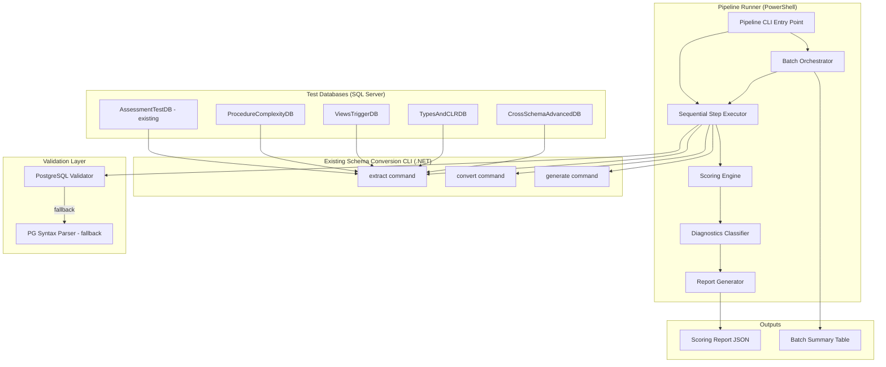
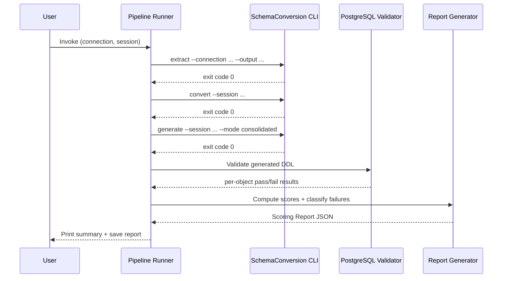

# Design Document: Migration Validation Pipeline

## Overview

This design describes a multi-database migration validation pipeline that automates the full Extract → Convert → Generate → Validate cycle for the AI-Assisted Schema Conversion tool. The pipeline orchestrates 5 test databases (1 existing + 4 new), computes a per-database and aggregate compatibility score, and produces actionable diagnostics that feed back into rule/prompt improvements.

The system is implemented as a PowerShell-based Pipeline Runner script alongside 4 new SQL Server setup scripts. It wraps the existing `SchemaConversion.Cli` commands, adds PostgreSQL DDL validation, produces JSON Scoring Reports, and supports batch execution and selective re-runs.

### Design Decisions

| Decision | Rationale |
|----------|-----------|
| PowerShell for pipeline orchestration | Aligns with existing `setup-test-database.sql` pattern; cross-platform via PowerShell Core; native JSON handling; easy process invocation of `dotnet run` |
| JSON Scoring Reports | Machine-readable, diff-friendly, integrates with the existing `report` command's JSON output |
| PostgreSQL live-instance validation with syntax-only fallback | Live validation gives highest confidence; fallback ensures pipeline still works without a running PG instance |
| Single `pipeline-config.json` for batch configuration | Centralizes database connection strings and session mappings; avoids argument explosion |
| Root cause classification via regex pattern matching on error messages | Simple, extensible, deterministic — avoids needing AI for error classification |

## Architecture



### Pipeline Execution Flow



## Components and Interfaces

### 1. Pipeline Runner (`scripts/Run-MigrationPipeline.ps1`)

The main orchestration script. Responsibilities:
- Parse command-line arguments (single-database or batch mode)
- Execute pipeline steps sequentially via `dotnet run`
- Track elapsed time per step and total
- Halt on failure with structured logging
- Support `--rerun-failures` mode
- Support `--batch` mode with config file

**Parameters:**
```
-ConnectionString   : SQL Server connection string (single-db mode)
-SessionName        : Session identifier
-BatchConfig        : Path to pipeline-config.json (batch mode)
-RerunFailures      : Switch to re-convert only failed objects
-ValidationMode     : "live-instance" | "syntax-only" (default: auto-detect)
-PgConnectionString : PostgreSQL connection string for live validation
```

### 2. Scoring Engine (`scripts/lib/Invoke-Scoring.ps1`)

Pure computation module. Responsibilities:
- Classify each object as pass, fail-syntax, fail-convert, or skip
- Compute per-database Compatibility_Score using the defined formula
- Compute aggregate score across databases (excluding N/A databases)
- Generate per-type breakdowns
- Compute score deltas from previous runs

**Interface:**
```powershell
function Invoke-Scoring {
    param(
        [Parameter(Mandatory)]
        [array]$ObjectResults,       # Array of per-object validation results
        [hashtable]$PreviousScores   # Previous run scores for delta calculation
    )
    # Returns: hashtable with scores, breakdowns, deltas
}
```

### 3. Diagnostics Classifier (`scripts/lib/Invoke-DiagnosticsClassification.ps1`)

Pattern-matching engine for root cause grouping. Responsibilities:
- Match error messages against category regex patterns
- Group failures by root cause category
- Rank categories by failure count
- List affected object names per category

**Category Patterns:**
| Category | Match Criteria |
|----------|---------------|
| type mapping gap | Error references unrecognized data type |
| function mapping gap | Error references undefined function or operator |
| procedural pattern not handled | Error occurs within PL/pgSQL block body |
| AI prompt deficiency | Conversion produced empty or placeholder output |
| dependency resolution failure | Error references missing prerequisite object |

### 4. PostgreSQL Validator (`scripts/lib/Invoke-PgValidation.ps1`)

DDL validation against PostgreSQL. Responsibilities:
- Attempt live-instance validation first (execute in rolled-back transaction)
- Fall back to syntax-only parsing if no PG instance available
- Resolve dependencies by creating prerequisite objects within the transaction
- Detect circular dependencies via topological sort
- Enforce 30-second timeout per statement
- Report per-object results independently

**Interface:**
```powershell
function Invoke-PgValidation {
    param(
        [Parameter(Mandatory)]
        [array]$DdlStatements,           # Array of {objectName, ddl, dependencies}
        [string]$PgConnectionString,     # Optional PG connection
        [int]$TimeoutSeconds = 30
    )
    # Returns: array of {objectName, status, errorMessage, lineNumber, validationMode}
}
```

### 5. Test Database Setup Scripts

Four new SQL scripts in `MigrationAssessment/scripts/`:

| Script | Database Name | Focus |
|--------|--------------|-------|
| `setup-procedure-complexity-db.sql` | ProcedureComplexityDB | Cursors, nested TRY/CATCH, multiple result sets, TVPs, OUTPUT params |
| `setup-views-triggers-db.sql` | ViewsTriggerDB | Indexed views, INSTEAD OF triggers, multi-table triggers, APPLY operators, nested views |
| `setup-types-clr-db.sql` | TypesAndCLRDB | Table types, alias types with rules, computed columns with UDFs, schema-bound objects, SQLCLR stubs |
| `setup-cross-schema-advanced-db.sql` | CrossSchemaAdvancedDB | Multi-schema dependencies, cross-database references, partitioned tables, RLS, temporal tables |

Each script follows the existing idempotent pattern (DROP IF EXISTS, CREATE, seed data).

### 6. Batch Configuration (`pipeline-config.json`)

```json
{
  "databases": [
    {
      "name": "AssessmentTestDB",
      "connectionString": "Server=localhost;Database=AssessmentTestDB;...",
      "sessionName": "assessment-test",
      "setupScript": "scripts/setup-test-database.sql"
    },
    {
      "name": "ProcedureComplexityDB",
      "connectionString": "Server=localhost;Database=ProcedureComplexityDB;...",
      "sessionName": "procedure-complexity",
      "setupScript": "scripts/setup-procedure-complexity-db.sql"
    }
  ],
  "validation": {
    "pgConnectionString": "Host=localhost;Database=validation_scratch;...",
    "timeoutSeconds": 30,
    "fallbackToSyntaxOnly": true
  },
  "reporting": {
    "outputDirectory": "./pipeline-reports",
    "trackProgression": true
  }
}
```

## Data Models

### Scoring Report Schema

```json
{
  "reportId": "uuid",
  "timestamp": "ISO-8601",
  "totalElapsedSeconds": 145.3,
  "validationMode": "live-instance | syntax-only",
  "configHashes": {
    "type-mappings.json": "sha256-abc...",
    "function-mappings.json": "sha256-def...",
    "schema-mappings.json": "sha256-ghi...",
    "stored-procedure.v1.0.0.md": "sha256-jkl..."
  },
  "databases": [
    {
      "name": "ProcedureComplexityDB",
      "sessionName": "procedure-complexity",
      "objectCount": 18,
      "elapsedSeconds": 32.1,
      "score": {
        "compatibilityScore": 72.2,
        "previousScore": 65.0,
        "delta": 7.2,
        "pass": 13,
        "failSyntax": 3,
        "failConvert": 2,
        "skip": 0
      },
      "byType": {
        "Table": { "pass": 5, "fail": 0, "score": 100.0 },
        "StoredProcedure": { "pass": 6, "fail": 4, "score": 60.0 },
        "View": { "pass": 2, "fail": 1, "score": 66.7 }
      },
      "objects": [
        {
          "name": "dbo.sp_ComplexCursor",
          "type": "StoredProcedure",
          "status": "fail-syntax",
          "errorMessage": "syntax error at or near \"DECLARE\"",
          "errorLineNumber": 12,
          "generatedDdl": "CREATE OR REPLACE FUNCTION..."
        }
      ]
    }
  ],
  "aggregate": {
    "compatibilityScore": 74.5,
    "previousScore": 68.2,
    "delta": 6.3,
    "totalPass": 62,
    "totalFailSyntax": 12,
    "totalFailConvert": 8,
    "totalSkip": 3
  },
  "diagnostics": {
    "rootCauseCategories": [
      {
        "category": "procedural pattern not handled",
        "count": 8,
        "objects": ["dbo.sp_ComplexCursor", "dbo.sp_NestedTryCatch", "..."]
      },
      {
        "category": "function mapping gap",
        "count": 5,
        "objects": ["dbo.fn_FormatDate", "..."]
      }
    ],
    "topFailingTypes": [
      { "type": "StoredProcedure", "failCount": 12 },
      { "type": "Function", "failCount": 5 }
    ]
  }
}
```

### Pipeline Step Result

```json
{
  "step": "extract | convert | generate | validate",
  "exitCode": 0,
  "elapsedSeconds": 12.4,
  "errorMessage": null,
  "objectsProcessed": 18
}
```

### Object Validation Result (internal)

```json
{
  "objectName": "dbo.sp_ProcessOrder",
  "objectType": "StoredProcedure",
  "schemaName": "dbo",
  "status": "pass | fail-syntax | fail-convert | skip",
  "errorMessage": null,
  "errorLineNumber": null,
  "generatedDdl": "CREATE OR REPLACE FUNCTION...",
  "dependencies": ["dbo.Orders", "dbo.OrderItems"],
  "validationMode": "live-instance | syntax-only"
}
```

## Correctness Properties

*A property is a characteristic or behavior that should hold true across all valid executions of a system — essentially, a formal statement about what the system should do. Properties serve as the bridge between human-readable specifications and machine-verifiable correctness guarantees.*

### Property 1: Sequential Pipeline Execution with Halt-on-Failure

*For any* pipeline configuration and *for any* step that returns a non-zero exit code, the Pipeline Runner SHALL have executed all preceding steps in order (extract → convert → generate → validate), SHALL NOT have executed any subsequent steps, and SHALL have logged the failure including step name, error message, and elapsed time in seconds.

**Validates: Requirements 2.1, 2.2**

### Property 2: Scoring Report Production on Success

*For any* set of converted objects with mixed validation outcomes (pass, fail-syntax, fail-convert, skip), when all four pipeline steps complete without halting, the Pipeline Runner SHALL produce a valid JSON Scoring Report containing a per-object status entry for every object and a correctly computed aggregate Compatibility_Score.

**Validates: Requirements 2.4**

### Property 3: Compatibility Score Computation

*For any* set of object results across one or more databases where at least one object is classified as pass, fail-syntax, or fail-convert, the Compatibility_Score SHALL equal `(pass count) / (pass + fail-syntax + fail-convert) * 100` rounded to one decimal place, computed both per-database and as an aggregate across all databases (excluding databases where all objects are "skip").

**Validates: Requirements 3.1, 3.3, 3.6**

### Property 4: Object Classification Correctness

*For any* schema object processed by the pipeline, the object SHALL be classified as exactly one of: "pass" (PostgreSQL validator accepts the DDL), "fail-syntax" (PostgreSQL validator rejects the DDL), "fail-convert" (conversion step failed or errored for this object), or "skip" (object type not in {Table, View, StoredProcedure, Function, Trigger}).

**Validates: Requirements 3.2**

### Property 5: Per-Type Score Breakdown Consistency

*For any* database result in the Scoring Report, the sum of pass and fail counts across all object type breakdowns SHALL equal the total pass + fail-syntax + fail-convert count for that database, and each per-type Compatibility_Score SHALL be correctly computed from that type's pass and fail counts.

**Validates: Requirements 3.5**

### Property 6: Top Failing Types Below Threshold

*For any* set of results where the aggregate Compatibility_Score is below 70%, the Scoring Report SHALL include up to 5 failing object types ranked in descending order by failure count, and each entry SHALL contain the correct failure count for that type.

**Validates: Requirements 3.4**

### Property 7: Failure Diagnostics Completeness

*For any* object with status "fail-syntax" or "fail-convert", the Scoring Report SHALL include the specific PostgreSQL syntax error message, the line number where parsing failed, and the full generated DDL text for that object.

**Validates: Requirements 4.1**

### Property 8: Root Cause Classification

*For any* set of failed objects, each failure SHALL be classified into exactly one root cause category based on pattern matching (type mapping gap, function mapping gap, procedural pattern not handled, AI prompt deficiency, dependency resolution failure), and categories SHALL be ranked in descending order by failure count with affected object names listed per category.

**Validates: Requirements 4.2, 4.6**

### Property 9: Selective Re-run of Failures

*For any* session containing a mix of passed and failed objects, when the Pipeline Runner is invoked in "rerun-failures" mode, it SHALL re-convert only objects with status "fail-syntax" or "fail-convert" from the most recent Scoring Report, and SHALL preserve all existing conversion results for objects with status "pass" or "skip".

**Validates: Requirements 4.3**

### Property 10: Change Detection Triggers Re-conversion

*For any* modification to a conversion rule file or prompt template (detected by SHA-256 hash difference from the previous Scoring Report), the Pipeline Runner SHALL re-convert objects of the types associated with the changed file, where prompt templates map to their corresponding object type and mapping files apply to all object types.

**Validates: Requirements 4.4**

### Property 11: Score Progression Delta

*For any* pipeline run that has a previous run for the same database, the Scoring Report SHALL include the previous Compatibility_Score and a delta value equal to (current score − previous score) for each database.

**Validates: Requirements 4.5**

### Property 12: Batch Configuration Parsing

*For any* valid pipeline-config.json file listing databases with connection strings, session names, and setup script paths, the Pipeline Runner SHALL parse all entries correctly and use them for batch execution.

**Validates: Requirements 5.1**

### Property 13: Batch Resilience on Database Failure

*For any* batch execution where one or more databases fail completely (e.g., connection failure), the Pipeline Runner SHALL log the error for the failed database(s) and continue executing the pipeline for all remaining configured databases.

**Validates: Requirements 5.4**

### Property 14: Batch Summary Table Completeness

*For any* completed batch execution, the Pipeline Runner SHALL print a summary containing database name, object count, pass count, fail count, and Compatibility_Score for each database that was processed.

**Validates: Requirements 5.3**

### Property 15: Dependency Resolution in Validation

*For any* DDL object that has dependencies on other objects, the PostgreSQL Validator SHALL create prerequisite objects within the same rolled-back transaction before validating the dependent object, ensuring dependency resolution errors are distinguished from syntax errors.

**Validates: Requirements 6.4**

### Property 16: Validation Isolation

*For any* set of DDL objects where some fail validation, all other objects SHALL still receive an independent pass/fail result — a failure in one object SHALL NOT prevent validation of unrelated objects.

**Validates: Requirements 6.5**

### Property 17: Circular Dependency Detection

*For any* set of DDL objects containing a circular dependency cycle, all objects participating in the cycle SHALL be marked as "fail-syntax" with an error message indicating circular dependency, and all objects not in the cycle SHALL be validated normally.

**Validates: Requirements 6.6**

## Error Handling

### Pipeline Step Failures

| Failure Type | Behavior |
|-------------|----------|
| Extract fails (non-zero exit) | Log step name + error + elapsed time; halt pipeline for that database |
| Convert fails (non-zero exit) | Log step name + error + elapsed time; halt pipeline for that database |
| Generate fails (non-zero exit) | Log step name + error + elapsed time; halt pipeline for that database |
| Validate throws unhandled exception | Log as validation infrastructure error; mark all unvalidated objects as "fail-syntax" |
| Connection timeout to SQL Server | Log connection error; in batch mode, skip database and continue |
| Connection timeout to PostgreSQL | Fall back to syntax-only validation mode; record in report |

### Batch Execution Failures

- A single database failure does NOT halt the entire batch
- Failed databases are recorded in the combined report with status "pipeline-error"
- The batch summary table shows "ERROR" for the failed database's score column
- Exit code is non-zero if any database fails completely, zero if all databases produce a Scoring Report (even with low scores)

### Validation Edge Cases

| Scenario | Handling |
|----------|----------|
| DDL statement exceeds 30s timeout | Mark as "fail-syntax" with timeout error message |
| Circular dependency detected | Mark all objects in cycle as "fail-syntax"; continue with remaining objects |
| Empty or null DDL from conversion | Classify as "fail-convert"; category = "AI prompt deficiency" |
| PostgreSQL instance unavailable | Switch to syntax-only mode; record `validationMode: "syntax-only"` in report |

### Configuration Errors

| Error | Behavior |
|-------|----------|
| Missing pipeline-config.json | Exit with error message pointing to expected path |
| Invalid JSON in config | Exit with parse error and line number |
| Missing required field in config entry | Skip that database entry; log warning |
| Setup script path doesn't exist | Log warning but continue (setup may already be done) |

## Testing Strategy

### Unit Tests (Pester - PowerShell)

The scoring engine and diagnostics classifier are pure functions suitable for unit testing:

- **Scoring computation**: Verify formula with known inputs (pass=7, fail-syntax=2, fail-convert=1 → 70.0%)
- **Object classification**: Verify each status classification rule
- **Root cause pattern matching**: Verify regex patterns against sample error messages
- **Delta computation**: Verify current − previous calculation
- **Configuration parsing**: Verify JSON deserialization to correct structures
- **Dependency ordering**: Verify topological sort produces valid execution order
- **Circular dependency detection**: Verify cycles are identified correctly

### Property-Based Tests (FsCheck - .NET)

The scoring, classification, and pipeline orchestration logic will be tested with property-based tests using **FsCheck** (the .NET property-based testing library). Each property test must run a minimum of 100 iterations and reference its design document property.

Tag format: **Feature: migration-validation-pipeline, Property {number}: {title}**

Properties 3, 4, 5, 6, 7, 8, 9, 10, 11, 13, 14, 16, and 17 are suitable for PBT because they involve pure computation or logic that varies meaningfully with input. Properties 1, 2, 12, and 15 involve process orchestration and are better covered by integration tests with mocked step executors.

### Integration Tests

- **Full pipeline execution** against the existing `AssessmentTestDB` (verifies end-to-end flow)
- **PostgreSQL validation** against a test PG instance with known-good and known-bad DDL
- **Batch execution** across all 5 databases
- **Idempotent script execution** (run each setup script twice, verify no errors)
- **Rerun-failures mode** (create a session with known failures, re-run, verify selective execution)

### Smoke Tests

- Each test database setup script runs without errors on SQL Server 2019+
- Each database has ≥ 15 objects after creation
- Pipeline Runner script loads and parses arguments correctly
- Batch config file is valid JSON and contains all 5 databases
