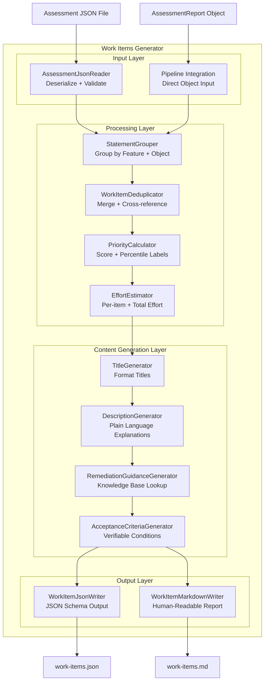
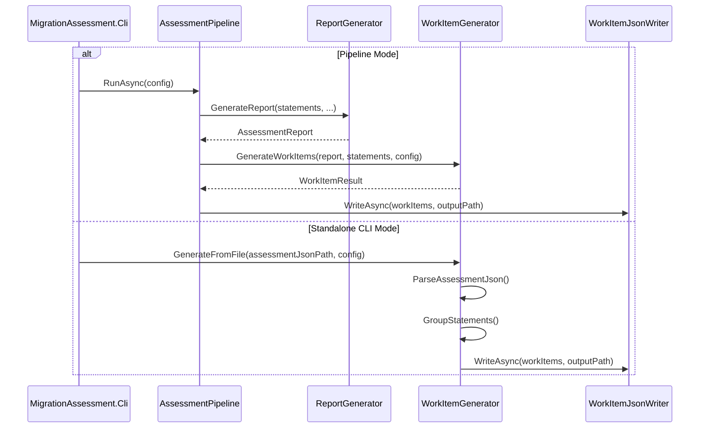

# Design Document: Migration Work Items Generator

## Overview

The Migration Work Items Generator extends the existing Migration Assessment Engine to transform assessment results into structured, actionable work item tickets. Where the assessment engine answers "what is the migration risk?", the work items generator answers "what exactly do developers need to do?"

The generator consumes either:
- A previously saved assessment JSON file (standalone CLI mode)
- An in-memory `AssessmentReport` + `AnalyzedStatement` collection (pipeline integration mode)

It then groups related statements by feature name and database object, calculates priority scores and effort estimates, generates professional ticket content with remediation guidance, and outputs both JSON (for project management tool import) and optional Markdown (for human review).

### Key Design Decisions

1. **New project in existing solution**: The work items generator lives as `MigrationAssessment.WorkItems` under `src/` and references `MigrationAssessment.Core` for shared models. This follows the existing pattern where each pipeline stage is a separate project.

2. **Knowledge base approach for remediation**: Rather than generating guidance dynamically, remediation templates are organized as a static knowledge base keyed by feature name. This makes guidance deterministic, testable, and extensible without code changes.

3. **Dual entry point**: The generator implements `IWorkItemGenerator` (for pipeline integration) and also exposes a CLI verb in the existing CLI project. This avoids creating a separate executable while keeping the logic independently testable.

4. **Grouping as a pure function**: The statement-to-work-item grouping logic is a pure transformation (input → output with no side effects), making it ideal for property-based testing.

5. **Priority percentile calculation**: Priority labels are derived from the ranked distribution of all work items rather than fixed thresholds, ensuring labels adapt to each assessment's specific profile.

## Architecture



### Layer Responsibilities

| Layer | Responsibility |
|-------|---------------|
| **Input** | Parse assessment JSON or accept in-memory objects; validate schema conformance |
| **Processing** | Group statements into logical work items, deduplicate, calculate priority and effort |
| **Content Generation** | Produce professional ticket content: titles, descriptions, remediation guidance, acceptance criteria |
| **Output** | Serialize work items to JSON and/or Markdown formats |

### Integration with Existing Pipeline



## Components and Interfaces

### Core Interface

```csharp
namespace MigrationAssessment.Core.Interfaces;

/// <summary>
/// Generates structured work items from assessment results.
/// </summary>
public interface IWorkItemGenerator
{
    /// <summary>
    /// Generates work items from in-memory assessment data (pipeline integration).
    /// </summary>
    WorkItemResult GenerateWorkItems(
        IReadOnlyList<AnalyzedStatement> statements,
        FeatureDetectionResult featureDetection,
        WorkItemConfiguration config);

    /// <summary>
    /// Generates work items from a saved assessment JSON file (standalone mode).
    /// </summary>
    Task<WorkItemResult> GenerateFromFileAsync(
        string assessmentJsonPath,
        WorkItemConfiguration config,
        CancellationToken ct);
}
```

### Work Item Configuration

```csharp
namespace MigrationAssessment.WorkItems.Models;

/// <summary>
/// Configuration for work item generation.
/// </summary>
public sealed record WorkItemConfiguration
{
    /// <summary>Output JSON file path. Default: "./work-items.json"</summary>
    public string OutputJsonPath { get; init; } = "./work-items.json";

    /// <summary>Whether to generate Markdown output. Default: false</summary>
    public bool MarkdownEnabled { get; init; } = false;

    /// <summary>Markdown output path. Default: same directory as JSON, "work-items.md"</summary>
    public string? MarkdownOutputPath { get; init; }

    /// <summary>Minimum risk level filter (1-5). Default: 1 (include all)</summary>
    public int MinimumRiskLevel { get; init; } = 1;

    /// <summary>Maximum work item count. Default: null (no limit)</summary>
    public int? MaxWorkItemCount { get; init; }
}
```

### Work Item Model

```csharp
namespace MigrationAssessment.WorkItems.Models;

/// <summary>
/// A single remediation work item ticket.
/// </summary>
public sealed record WorkItem
{
    /// <summary>Unique identifier in format "WI-001"</summary>
    public required string Id { get; init; }

    /// <summary>Title, max 120 chars: "[Risk N] Convert feature_name in object_name"</summary>
    public required string Title { get; init; }

    /// <summary>Plain-language description of the issue and business impact</summary>
    public required string Description { get; init; }

    /// <summary>Actual SQL excerpt demonstrating the SQL Server construct (max 500 chars)</summary>
    public required string SqlServerPattern { get; init; }

    /// <summary>PostgreSQL equivalent code example</summary>
    public required string PostgresEquivalent { get; init; }

    /// <summary>List of affected database objects</summary>
    public required IReadOnlyList<AffectedObject> AffectedObjects { get; init; }

    /// <summary>Risk level 1-5</summary>
    public required int RiskLevel { get; init; }

    /// <summary>Priority label: Critical, High, Medium, Low</summary>
    public required string Priority { get; init; }

    /// <summary>Numeric priority score (sum of weighted risks)</summary>
    public required double PriorityScore { get; init; }

    /// <summary>Estimated effort range</summary>
    public required HourRange EstimatedEffort { get; init; }

    /// <summary>Verifiable acceptance criteria</summary>
    public required IReadOnlyList<string> AcceptanceCriteria { get; init; }

    /// <summary>Detailed remediation guidance</summary>
    public required string RemediationGuidance { get; init; }

    /// <summary>Tags for categorization and filtering</summary>
    public required IReadOnlyList<string> Tags { get; init; }

    /// <summary>Related work item IDs for the same database object</summary>
    public IReadOnlyList<string> RelatedWorkItemIds { get; init; } = [];
}

/// <summary>
/// A database object affected by a work item.
/// </summary>
public sealed record AffectedObject
{
    /// <summary>Object name (schema.name or "Ad Hoc Queries")</summary>
    public required string Name { get; init; }

    /// <summary>Object type: StoredProcedure, Function, View, Trigger, AdHoc</summary>
    public required string Type { get; init; }

    /// <summary>Number of statements within this object referencing the feature</summary>
    public required int StatementCount { get; init; }
}
```

### Work Item Result

```csharp
namespace MigrationAssessment.WorkItems.Models;

/// <summary>
/// Result of work item generation.
/// </summary>
public sealed record WorkItemResult
{
    /// <summary>All generated work items, ordered by PriorityScore descending</summary>
    public required IReadOnlyList<WorkItem> WorkItems { get; init; }

    /// <summary>Generation metadata</summary>
    public required WorkItemMetadata Metadata { get; init; }

    /// <summary>Whether generation succeeded</summary>
    public bool Succeeded { get; init; } = true;

    /// <summary>Error message if generation failed</summary>
    public string? ErrorMessage { get; init; }
}

/// <summary>
/// Metadata about the work item generation run.
/// </summary>
public sealed record WorkItemMetadata
{
    public required DateTimeOffset GeneratedAt { get; init; }
    public required string? SourceAssessmentPath { get; init; }
    public required int TotalWorkItemCount { get; init; }
    public required HourRange TotalEstimatedEffort { get; init; }
}
```

### Statement Grouper

```csharp
namespace MigrationAssessment.WorkItems;

/// <summary>
/// Groups analyzed statements into logical work item clusters based on
/// feature name and database object affinity.
/// </summary>
public interface IStatementGrouper
{
    /// <summary>
    /// Groups statements into work item clusters.
    /// Each cluster becomes one work item.
    /// </summary>
    IReadOnlyList<StatementGroup> GroupStatements(
        IReadOnlyList<AnalyzedStatement> statements,
        FeatureDetectionResult featureDetection,
        int minimumRiskLevel);
}

/// <summary>
/// A group of related statements that will become a single work item.
/// </summary>
public sealed record StatementGroup
{
    /// <summary>The feature name this group represents</summary>
    public required string FeatureName { get; init; }

    /// <summary>The database object containing these statements (null for ad hoc)</summary>
    public string? DatabaseObjectName { get; init; }

    /// <summary>Type of the database object</summary>
    public string DatabaseObjectType { get; init; } = "AdHoc";

    /// <summary>All statements in this group</summary>
    public required IReadOnlyList<AnalyzedStatement> Statements { get; init; }

    /// <summary>Whether this is a server-level feature (from feature inventory)</summary>
    public bool IsServerLevelFeature { get; init; }

    /// <summary>The highest risk level among grouped statements</summary>
    public required int MaxRiskLevel { get; init; }
}
```

### Priority Calculator

```csharp
namespace MigrationAssessment.WorkItems;

/// <summary>
/// Calculates priority scores and assigns percentile-based priority labels.
/// </summary>
public interface IPriorityCalculator
{
    /// <summary>
    /// Calculates priority score for a statement group.
    /// Score = sum of WeightedRisk across all statements in the group.
    /// </summary>
    double CalculatePriorityScore(StatementGroup group);

    /// <summary>
    /// Assigns priority labels to all work items based on percentile ranking.
    /// Critical: top 10%, High: 70-89th percentile, Medium: 30-69th, Low: below 30th.
    /// </summary>
    IReadOnlyList<(WorkItem Item, string Priority)> AssignPriorityLabels(
        IReadOnlyList<WorkItem> workItems);
}
```

### Effort Estimator

```csharp
namespace MigrationAssessment.WorkItems;

/// <summary>
/// Estimates effort for work items based on risk level and statement count
/// with a complexity reduction factor for repeated patterns.
/// </summary>
public interface IEffortEstimator
{
    /// <summary>
    /// Calculates effort for a work item.
    /// First statement uses full effort range for its risk level.
    /// Each additional statement applies a 0.7 reduction factor.
    /// </summary>
    HourRange EstimateEffort(int riskLevel, int statementCount);

    /// <summary>
    /// Aggregates effort across all work items.
    /// </summary>
    HourRange CalculateTotalEffort(IReadOnlyList<WorkItem> workItems);
}
```

### Remediation Knowledge Base

```csharp
namespace MigrationAssessment.WorkItems;

/// <summary>
/// Provides remediation guidance templates for known SQL Server features.
/// </summary>
public interface IRemediationKnowledgeBase
{
    /// <summary>
    /// Gets remediation guidance for a feature, including PostgreSQL equivalent.
    /// </summary>
    RemediationEntry? GetGuidance(string featureName);

    /// <summary>
    /// Checks if a feature has known guidance.
    /// </summary>
    bool HasGuidance(string featureName);
}

/// <summary>
/// A remediation guidance entry from the knowledge base.
/// </summary>
public sealed record RemediationEntry
{
    /// <summary>The PostgreSQL equivalent pattern/syntax</summary>
    public required string PostgresEquivalent { get; init; }

    /// <summary>Step-by-step remediation instructions</summary>
    public required string RemediationSteps { get; init; }

    /// <summary>Why the SQL Server construct is incompatible</summary>
    public required string IncompatibilityExplanation { get; init; }

    /// <summary>Risk level this entry applies to</summary>
    public required int RiskLevel { get; init; }

    /// <summary>Whether this requires architectural review</summary>
    public bool RequiresArchitecturalReview { get; init; }

    /// <summary>Relevant PostgreSQL documentation area</summary>
    public string? PostgresDocReference { get; init; }
}
```

### Output Writers

```csharp
namespace MigrationAssessment.WorkItems;

/// <summary>
/// Writes work items to a JSON file conforming to the published schema.
/// </summary>
public interface IWorkItemJsonWriter
{
    Task<JsonWriteResult> WriteAsync(
        WorkItemResult result,
        string outputPath,
        CancellationToken ct);
}

/// <summary>
/// Writes work items to a human-readable Markdown file.
/// </summary>
public interface IWorkItemMarkdownWriter
{
    Task<JsonWriteResult> WriteAsync(
        WorkItemResult result,
        string outputPath,
        CancellationToken ct);
}
```

## Data Models

### Grouping Algorithm

The grouping algorithm processes statements in a deterministic order:

1. **Filter** by minimum risk level (exclude statements below threshold)
2. **Extract features**: For each statement, extract `(FeatureName, DatabaseObject)` pairs
3. **Multi-feature assignment rule**:
   - If a statement has features at different risk levels → assign to highest-risk feature group
   - If a statement has features at the same risk level → assign to all matching groups (statement appears in multiple work items)
4. **Group by key**: `(FeatureName, DatabaseObjectName)` — one work item per unique key
5. **Ad hoc handling**: Statements with no owning object use key `(FeatureName, null)` and get the label "Ad Hoc Queries"
6. **Server-level features**: Feature inventory entries with `occurrenceCount > 0` create one work item each, independent of statement grouping

### Effort Estimation Table

Per-statement effort ranges by risk level (matching existing assessment engine ranges):

| Risk Level | Min Hours (first statement) | Max Hours (first statement) |
|-----------|----------------------------|----------------------------|
| 1 | 0 | 0.08 (5 min) |
| 2 | 0.08 | 0.5 (30 min) |
| 3 | 0.5 | 4 |
| 4 | 4 | 40 |
| 5 | 40 | 80 |

**Complexity reduction formula** for N statements:
```
TotalMinHours = BaseMin × (1 + 0.7 + 0.7² + ... + 0.7^(N-1))
             = BaseMin × (1 - 0.7^N) / (1 - 0.7)
TotalMaxHours = BaseMax × (1 - 0.7^N) / (1 - 0.7)
```

This geometric series converges, recognizing that fixing the same pattern in multiple places within one object requires diminishing incremental effort.

### Priority Score Calculation

```
PriorityScore = Σ (statement.WeightedRisk) for all statements in work item
```

Where `WeightedRisk = RiskScore × ExecutionFrequency × BusinessImportance` (already computed by the assessment engine).

### Priority Label Assignment (Percentile-Based)

Given all work items sorted by PriorityScore descending:
- **Critical**: Items at rank ≤ ceil(totalCount × 0.10) — top 10%
- **High**: Items at rank (top 10% < rank ≤ top 30%) — 70th-89th percentile
- **Medium**: Items at rank (top 30% < rank ≤ top 70%) — 30th-69th percentile
- **Low**: Items at rank > top 70% — below 30th percentile

Tie-breaking for equal PriorityScore: higher risk level first, then higher statement count.

### JSON Output Schema

```json
{
  "$schema": "https://json-schema.org/draft/2020-12/schema",
  "type": "object",
  "properties": {
    "metadata": {
      "type": "object",
      "properties": {
        "generatedAt": { "type": "string", "format": "date-time" },
        "sourceAssessmentPath": { "type": ["string", "null"] },
        "totalWorkItemCount": { "type": "integer" },
        "totalEstimatedEffort": {
          "type": "object",
          "properties": {
            "minHours": { "type": "number" },
            "maxHours": { "type": "number" }
          }
        }
      },
      "required": ["generatedAt", "totalWorkItemCount", "totalEstimatedEffort"]
    },
    "workItems": {
      "type": "array",
      "items": {
        "type": "object",
        "properties": {
          "id": { "type": "string", "pattern": "^WI-\\d{3,}$" },
          "title": { "type": "string", "maxLength": 120 },
          "description": { "type": "string" },
          "sqlServerPattern": { "type": "string" },
          "postgresEquivalent": { "type": "string" },
          "affectedObjects": {
            "type": "array",
            "items": {
              "type": "object",
              "properties": {
                "name": { "type": "string" },
                "type": { "type": "string" },
                "statementCount": { "type": "integer" }
              },
              "required": ["name", "type", "statementCount"]
            }
          },
          "riskLevel": { "type": "integer", "minimum": 1, "maximum": 5 },
          "priority": { "type": "string", "enum": ["Critical", "High", "Medium", "Low"] },
          "priorityScore": { "type": "number" },
          "estimatedEffort": {
            "type": "object",
            "properties": {
              "minHours": { "type": "number" },
              "maxHours": { "type": "number" }
            },
            "required": ["minHours", "maxHours"]
          },
          "acceptanceCriteria": {
            "type": "array",
            "items": { "type": "string" },
            "minItems": 2
          },
          "remediationGuidance": { "type": "string" },
          "tags": {
            "type": "array",
            "items": { "type": "string" }
          },
          "relatedWorkItemIds": {
            "type": "array",
            "items": { "type": "string" }
          }
        },
        "required": ["id", "title", "description", "sqlServerPattern", "postgresEquivalent",
                     "affectedObjects", "riskLevel", "priority", "priorityScore",
                     "estimatedEffort", "acceptanceCriteria", "remediationGuidance", "tags"]
      }
    }
  },
  "required": ["metadata", "workItems"]
}
```

### Markdown Output Structure

```markdown
# Migration Work Items Report

**Generated:** 2024-01-15T10:30:00Z
**Source:** ./assessment-output.json
**Total Work Items:** 12
**Estimated Effort:** 45-180 hours

## Risk Distribution

| Priority | Count |
|----------|-------|
| Critical | 2 |
| High | 3 |
| Medium | 5 |
| Low | 2 |

## Table of Contents

- [Critical Priority](#critical-priority)
- [High Priority](#high-priority)
- [Medium Priority](#medium-priority)
- [Low Priority](#low-priority)

## Critical Priority

### WI-001: [Risk 5] Convert XML_METHOD in dbo.GetOrderDetails

**Description:** ...

**SQL Server Pattern:**
```sql
...
```

**PostgreSQL Equivalent:**
```sql
...
```

**Affected Objects:**
- dbo.GetOrderDetails (Stored Procedure) — 3 statements

**Acceptance Criteria:**
1. All XML .value(), .query(), .nodes() calls have been replaced
2. PostgreSQL xpath() or jsonb functions produce equivalent results
```


## Correctness Properties

*A property is a characteristic or behavior that should hold true across all valid executions of a system — essentially, a formal statement about what the system should do. Properties serve as the bridge between human-readable specifications and machine-verifiable correctness guarantees.*

### Property 1: Grouping key uniqueness

*For any* collection of analyzed statements, the Work_Item_Generator SHALL produce at most one work item per unique `(FeatureName, DatabaseObjectName)` pair. Every statement assigned to a work item shares the same feature name and database object as that work item's grouping key. Statements with no database object SHALL be grouped under the key `(FeatureName, null)` labeled "Ad Hoc Queries".

**Validates: Requirements 2.1, 2.2, 2.6, 8.1**

### Property 2: Multi-feature highest-risk assignment

*For any* analyzed statement containing multiple detected features at different risk levels, the statement SHALL be assigned exclusively to the work item group for the feature with the highest risk level. The statement SHALL NOT appear in work item groups for its lower-risk features.

**Validates: Requirements 2.3**

### Property 3: Same-risk multi-feature inclusion

*For any* analyzed statement containing multiple detected features at the same risk level, the statement SHALL appear in the work item for each of those features. The number of work item groups containing that statement SHALL equal the number of distinct features at that (maximum) risk level.

**Validates: Requirements 2.4**

### Property 4: Server-level feature coverage

*For any* FeatureDetectionResult containing N features with occurrence count greater than zero, the Work_Item_Generator SHALL produce exactly N server-level work items — one per feature category with non-zero count. Features with occurrence count of zero SHALL NOT produce a work item.

**Validates: Requirements 2.5**

### Property 5: Work item structural completeness

*For any* generated work item, it SHALL contain: a non-empty title (≤120 characters), a non-empty description, a non-empty sqlServerPattern (≤500 characters), a non-empty postgresEquivalent, at least one affected object (each with non-empty name, valid type, and statementCount ≥ 1), a riskLevel in [1,5], an estimatedEffort with minHours ≤ maxHours, and at least 2 acceptance criteria strings.

**Validates: Requirements 3.1, 3.6, 3.7**

### Property 6: Title format conformance

*For any* generated work item with risk level R, feature name F, and primary object name O, the title SHALL match the pattern `[Risk R] Convert F in O` and SHALL NOT exceed 120 characters.

**Validates: Requirements 3.2**

### Property 7: SQL pattern sourced from input

*For any* generated work item, the sqlServerPattern field SHALL be a substring (up to 500 characters) of at least one analyzed statement's SqlText that was grouped into that work item.

**Validates: Requirements 3.4**

### Property 8: Primary example is highest weighted risk

*For any* work item containing multiple merged statements, the SQL Server pattern example SHALL be sourced from the statement with the highest WeightedRisk value among all statements in that group.

**Validates: Requirements 8.2**

### Property 9: Priority score equals sum of weighted risks

*For any* work item, its PriorityScore SHALL equal the sum of WeightedRisk values across all analyzed statements grouped into that work item. This sum incorporates execution frequency and business importance from the assessment.

**Validates: Requirements 5.1, 8.3**

### Property 10: Percentile-based priority labels

*For any* collection of generated work items sorted by PriorityScore descending, the priority labels SHALL be assigned as: "Critical" for items at rank ≤ ⌈count × 0.10⌉, "High" for items at rank in (top 10%, top 30%], "Medium" for items at rank in (top 30%, top 70%], and "Low" for items at rank > top 70%.

**Validates: Requirements 5.2**

### Property 11: Effort estimation geometric series

*For any* work item with risk level R and statement count N, the estimated effort SHALL satisfy:
- `minHours = BaseMin(R) × (1 - 0.7^N) / 0.3`
- `maxHours = BaseMax(R) × (1 - 0.7^N) / 0.3`

where BaseMin and BaseMax are the per-statement effort ranges defined by risk level, and the highest risk level in the group is used when statements have mixed risk levels.

**Validates: Requirements 5.3, 5.6**

### Property 12: Total effort equals sum of parts

*For any* collection of generated work items, the total effort summary SHALL satisfy:
- `totalMinHours = Σ workItem.EstimatedEffort.MinHours`
- `totalMaxHours = Σ workItem.EstimatedEffort.MaxHours`

**Validates: Requirements 5.5**

### Property 13: Output ordering by priority

*For any* generated work item collection, the output SHALL be ordered by PriorityScore descending. For items with equal PriorityScore, ordering SHALL be by riskLevel descending, then by total affected statement count descending.

**Validates: Requirements 5.4, 6.4**

### Property 14: JSON schema validation

*For any* valid input (non-empty assessment data with at least one analyzable statement), the serialized JSON output SHALL validate against the published work items JSON schema. This implies all required fields are present, types are correct, and structural constraints are met.

**Validates: Requirements 6.1, 6.2, 6.5**

### Property 15: Tags completeness

*For any* generated work item with risk level R, feature category C, and conversion category V, the tags array SHALL contain exactly: "risk-R" (e.g., "risk-4"), one of {"query-feature", "function-usage", "temporary-object", "transaction-feature", "server-feature"} matching C, and one of {"automatic", "semi-automatic", "manual"} matching V.

**Validates: Requirements 6.3**

### Property 16: Work item ID uniqueness and format

*For any* generated work item collection of size N, all IDs SHALL be unique, match the pattern `WI-\d{3,}`, and form a sequential series starting at "WI-001" through "WI-{N:D3}".

**Validates: Requirements 8.4**

### Property 17: Cross-references for shared objects

*For any* database object that appears in K > 1 work items (due to multiple distinct features), each of those K work items SHALL contain RelatedWorkItemIds listing the IDs of the other (K-1) work items sharing that object.

**Validates: Requirements 8.5**

### Property 18: Risk level filter enforcement

*For any* configured minimum risk level M in [1,5], all generated work items SHALL have riskLevel ≥ M. No statements with risk level below M SHALL contribute to any work item.

**Validates: Requirements 9.4**

### Property 19: Maximum count limit enforcement

*For any* configured maximum work item count limit L ≥ 1, the output SHALL contain at most L work items, and those L items SHALL be the top L by PriorityScore from the full untruncated set.

**Validates: Requirements 9.5**

### Property 20: Invalid input produces validation error

*For any* string that is either not valid JSON or valid JSON that does not conform to the assessment output schema, the Work_Item_Generator SHALL return a failed result with a non-empty error message describing the schema violation.

**Validates: Requirements 1.4**

## Error Handling

### Input Validation Errors

| Error Condition | Behavior |
|----------------|----------|
| Assessment JSON file not found | Return error with file path and "file not found" message |
| Invalid JSON syntax | Return error with parse position and syntax error description |
| Valid JSON but schema mismatch | Return error identifying the specific missing/invalid field |
| Empty assessment (0 statements, 0 features) | Return success with empty work item list and informational message |
| Configuration: risk level outside 1-5 | Return validation error: parameter name, value, valid range [1,5] |
| Configuration: max count < 1 | Return validation error: parameter name, value, valid range [1, ∞) |

### Processing Errors

| Error Condition | Behavior |
|----------------|----------|
| Unknown feature in knowledge base | Generate work item with "requires-research" tag and manual analysis message |
| Statement SQL text exceeds 500 chars for pattern | Truncate to 500 characters with "..." suffix |
| Title exceeds 120 characters | Truncate object name portion to fit, preserving risk level and feature name |
| Division by zero in percentile calculation (1 work item) | Assign "Critical" to the single item |

### Output Errors

| Error Condition | Behavior |
|----------------|----------|
| Cannot write JSON to specified path | Return error with target path and OS error message |
| Cannot write Markdown to specified path | Return error with target path and OS error message |
| Output directory does not exist | Attempt to create directory; if that fails, return error |

### Logging Strategy

All operations use `Microsoft.Extensions.Logging.ILogger<T>`:
- **Information**: Work item count generated, total effort summary, output paths
- **Warning**: Feature not found in knowledge base, SQL text truncation, title truncation
- **Error**: File not found, schema validation failure, file write failure
- **Debug**: Individual grouping decisions, per-statement assignment details

## Testing Strategy

### Testing Framework

- **Unit Tests**: xUnit 2.9+ with FluentAssertions 6.12+
- **Property-Based Tests**: FsCheck.Xunit 2.16+ (C# integration for xUnit)
- **Mocking**: NSubstitute for interface mocking
- **Integration Tests**: CLI invocation tests with the existing `test-assessment.json`

### Property-Based Testing Configuration

Each property test runs a minimum of **100 iterations** using FsCheck's `Arbitrary<T>` generators. Custom generators are built for:

- `AnalyzedStatement` — random SQL text (1-1000 chars), random features (0-5 per statement), random risk scores (1-5), random weighted risk, random execution counts, optional database object names
- `DetectedFeature` — feature names drawn from the known risk map plus unknown features, random categories, random positions
- `FeatureDetectionResult` — random feature counts (0-50) across all known server-level features
- `WorkItemConfiguration` — random valid and invalid configurations
- Collections of statements with controlled feature/object distributions for grouping tests

Each property test is tagged with a comment referencing the design property:
```csharp
// Feature: migration-work-items, Property 1: Grouping key uniqueness
[Property(MaxTest = 100)]
public Property GroupingProducesUniqueKeys() { ... }
```

### Unit Test Coverage

Unit tests cover:
- **JSON ingestion**: Parsing the existing `test-assessment.json` file and verifying all fields extracted
- **Knowledge base**: Each known feature (TOP, ISNULL, MERGE, XML_METHOD, etc.) has remediation guidance
- **Title formatting**: Boundary cases (long feature names, long object names, truncation)
- **Configuration validation**: Each invalid configuration scenario produces correct error
- **CLI argument parsing**: All argument combinations including missing required args
- **Markdown formatting**: Structural correctness of generated markdown
- **Edge cases**: Single statement, single feature, all statements same risk, empty feature inventory

### Integration Test Coverage

Integration tests (using `test-assessment.json`):
- End-to-end CLI invocation producing JSON output
- End-to-end CLI invocation producing both JSON and Markdown
- Pipeline integration generating work items directly from assessment data
- JSON output validates against the published schema
- Markdown output is well-formed and contains expected sections

### Project Structure for Tests

```
tests/
├── MigrationAssessment.WorkItems.Tests/      # Unit + property tests for work item generation
│   ├── Generators/                           # FsCheck custom generators
│   │   ├── AnalyzedStatementGenerator.cs
│   │   ├── FeatureDetectionResultGenerator.cs
│   │   └── WorkItemConfigurationGenerator.cs
│   ├── GroupingTests.cs                      # Property tests for statement grouping
│   ├── PriorityCalculatorTests.cs            # Property tests for scoring/labeling
│   ├── EffortEstimatorTests.cs               # Property tests for effort formula
│   ├── OutputOrderingTests.cs                # Property tests for ordering invariants
│   ├── ContentGenerationTests.cs             # Property tests for structural completeness
│   ├── JsonSchemaValidationTests.cs          # Property tests for schema conformance
│   ├── RemediationKnowledgeBaseTests.cs      # Unit tests for each feature's guidance
│   ├── ConfigurationValidationTests.cs       # Unit tests for config edge cases
│   └── WorkItemJsonReaderTests.cs            # Unit tests for JSON parsing
└── MigrationAssessment.WorkItems.Integration.Tests/  # Integration tests
    ├── CliInvocationTests.cs
    └── PipelineIntegrationTests.cs
```

### Test Execution

```bash
# Unit + property tests (no external dependencies)
dotnet test --filter "Category!=Integration" --project tests/MigrationAssessment.WorkItems.Tests

# Integration tests
dotnet test --filter "Category=Integration" --project tests/MigrationAssessment.WorkItems.Integration.Tests
```
